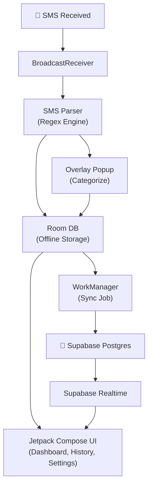

# Personal Expense Tracker — Product Roadmap

## Overview

A personal native Android app that reads SMS from selected contacts (e.g. M-Pesa, bank), auto-detects income vs expenses, prompts you to categorize each transaction via an overlay popup, and syncs everything to **Supabase (Postgres)** — with full offline support.

---

## Recommended Tech Stack

| Layer | Technology | Why |
|---|---|---|
| **Mobile App** | **Kotlin + Jetpack Compose** | Native Android — required for SMS access, overlay permissions, background services. |
| **Local DB** | **Room (SQLite)** | Offline-first storage, built-in LiveData/Flow support, easy migration. |
| **Backend / DB** | **Supabase (Postgres)** | SQL-based, real-time subscriptions, Row Level Security, generous free tier. |
| **Auth** | **Supabase Auth (Google)** | Secures your data with Google sign-in, easy setup. |
| **Notifications / Overlay** | **Android Foreground Service + System Alert Window** | Enables the "popup anywhere" behavior when a new transaction SMS arrives. |
| **Build** | **Gradle (Kotlin DSL)** | Standard Android build system. |
| **CI (optional)** | **GitHub Actions** | Auto-build APKs on push. |

> [!IMPORTANT]
> **Why Native Android (Kotlin)?**
> - SMS reading requires `READ_SMS` + `BroadcastReceiver` — native APIs only.
> - Drawing over other apps requires `SYSTEM_ALERT_WINDOW` — only reliable natively.
> - Background processing with `WorkManager` integrates cleanly with Android lifecycle.
> - Supabase has a [Kotlin client](https://supabase.com/docs/reference/kotlin/introduction) with full support.

---

## Core Features (Your Requirements)

### 1. SMS Monitoring & Parsing
- Register a `BroadcastReceiver` for `SMS_RECEIVED`.
- Filter by sender address (user-configurable whitelist, e.g. `MPESA`, `KCB`, `Equity`).
- Regex-based parser to extract: **amount**, **direction** (received/sent), **reference**, **timestamp**, **balance**.
- Support for multiple SMS formats (M-Pesa, bank alerts, etc.).

### 2. Transaction Classification
- Auto-detect **income** (money received) vs **expense** (money sent/paid) from SMS keywords.
- Flag ambiguous transactions for manual review.

### 3. Overlay Popup (Categorization Prompt)
- On new transaction detection → show a floating overlay (like Messenger chat heads).
- Popup contains: amount, direction, a **category picker**, and an optional **note** field.
- Quick-action buttons: confirm, dismiss, "categorize later".
- Timeout → auto-save as "Uncategorized" after 30 seconds.

### 4. Category Management
- Predefined categories: Food, Transport, Rent, Utilities, Salary, Freelance, Gifts, etc.
- Add/edit/delete custom categories.
- Color and icon per category.

### 5. Offline-First with Supabase Sync
- All transactions saved to **Room** first (source of truth).
- `WorkManager` job syncs to **Supabase Postgres** when connectivity is available.
- Supabase **Realtime** subscriptions keep app in sync with server.
- Conflict resolution: local timestamp wins (personal app, single device).

### 6. Dashboard
- Monthly summary: total income, total expenses, net balance.
- Category-wise breakdown (pie/bar charts via Vico).
- Recent transactions list with search & filter.

---

## Additional Features You Should Have

### 7. Recurring Transaction Detection
- Auto-detect patterns (e.g. rent on the 1st, salary on the 25th).
- Show predicted upcoming expenses/income.

### 8. Budget Limits
- Set monthly budget per category.
- Alert when approaching or exceeding a limit.

### 9. Export & Backup
- Export to CSV/Excel for your own records.
- Supabase backup is automatic, but add manual export option.
- Google Drive backup (optional).

### 10. Multi-Account Tracking
- Tag transactions by account (M-Pesa, Bank A, Bank B, Cash).
- Track balances per account using parsed SMS balance info.

### 11. Smart Categorization (ML-lite)
- After ~50+ manually categorized transactions, auto-suggest categories for new ones.
- Simple keyword-frequency matching — no heavy ML needed.

### 12. Daily/Weekly Digest Notification
- Push notification summary: "Today you spent KES 2,340 across 5 transactions."

### 13. PIN / Biometric Lock
- App lock with fingerprint or PIN — it's your financial data.

### 14. Debt / Lend Tracker
- Mark transactions as "lent to X" or "borrowed from Y".
- Track outstanding amounts.

### 15. Savings & Investments Tracker
- Create **savings goals** (e.g. "Emergency Fund — KES 100k") with target amount and deadline.
- Track progress with visual progress bars.
- **Investment portfolio**: log investments (M-Shwari, MMF, SACCO, stocks) with buy-in amounts.
- Manual value updates to track returns/growth over time.
- Dashboard widget showing total saved, total invested, and net worth.
- Option to auto-allocate a % of income to savings goals.

---

## Architecture Diagram



---

## Development Phases

### Phase 1 — Foundation (Week 1–2)
- [ ] Set up Android project (Kotlin, Jetpack Compose, Room, Hilt)
- [ ] Design data models: `Transaction`, `Category`, `Account`, `SmsSource`, `SavingsGoal`, `Investment`
- [ ] Implement Room database with DAOs
- [ ] Build SMS `BroadcastReceiver` + parser for M-Pesa format
- [ ] Basic settings screen: add/remove monitored SMS senders
- [ ] Set up Supabase project (Postgres + Auth)

### Phase 2 — Core Loop (Week 3–4)
- [ ] Implement overlay popup service (`SYSTEM_ALERT_WINDOW`)
- [ ] Category picker UI in popup
- [ ] Transaction list screen with search & filters
- [ ] Monthly summary dashboard with charts (Vico)
- [ ] Manual transaction entry (for cash payments)
- [ ] Category CRUD screens

### Phase 3 — Supabase Sync (Week 5)
- [ ] Supabase Kotlin client setup
- [ ] Google sign-in via Supabase Auth
- [ ] `WorkManager`-based sync: Room → Supabase Postgres
- [ ] Supabase Realtime subscription for live updates
- [ ] Row Level Security policies for your data

### Phase 4 — Polish & Extra Features (Week 6–7)
- [ ] Budget limits + alerts
- [ ] Recurring transaction detection
- [ ] Multi-account tracking
- [ ] Savings goals + investment tracking screens
- [ ] Export to CSV
- [ ] App lock (biometric/PIN)
- [ ] Additional SMS format parsers (banks)

### Phase 5 — Quality of Life (Week 8)
- [ ] Smart category suggestions
- [ ] Daily digest notifications
- [ ] Debt tracker
- [ ] Net worth dashboard (balances + savings + investments)
- [ ] UI polish, micro-animations, dark mode
- [ ] Edge case handling & testing

---

## Project Structure

```
app/
├── data/
│   ├── local/
│   │   ├── db/            # Room database, entities, DAOs
│   │   └── preferences/   # DataStore preferences
│   ├── remote/
│   │   └── supabase/      # Supabase client, repository, sync logic
│   └── repository/        # Repository pattern (abstracts local + remote)
├── domain/
│   ├── model/             # Domain models
│   ├── usecase/           # Business logic (parse SMS, classify, sync)
│   └── parser/            # SMS regex parsers per provider
├── service/
│   ├── SmsReceiver.kt     # BroadcastReceiver
│   ├── OverlayService.kt  # Floating popup service
│   └── SyncWorker.kt      # WorkManager sync job
├── ui/
│   ├── dashboard/         # Home screen with summary
│   ├── transactions/      # Transaction list & detail
│   ├── categories/        # Category management
│   ├── savings/           # Savings goals & investments
│   ├── settings/          # SMS source config, account settings
│   ├── overlay/           # Overlay popup composables
│   └── theme/             # Colors, typography, shapes
└── di/                    # Hilt modules
```

---

## Key Android Permissions

| Permission | Purpose |
|---|---|
| `READ_SMS` | Read incoming SMS for transaction parsing |
| `RECEIVE_SMS` | Detect new SMS in real-time |
| `SYSTEM_ALERT_WINDOW` | Draw overlay popup on any screen |
| `INTERNET` | Supabase sync |
| `RECEIVE_BOOT_COMPLETED` | Restart SMS listener after reboot |
| `FOREGROUND_SERVICE` | Keep SMS monitoring alive |
| `USE_BIOMETRIC` | App lock |

> [!WARNING]
> `READ_SMS` and `RECEIVE_SMS` are restricted permissions on Google Play. Since this is personal-use only (sideloaded APK), this is not an issue.

---

## Getting Started — First Steps

1. **Install Android Studio** (latest stable)
2. **Create a new project**: Empty Compose Activity, min SDK 26 (Android 8)
3. **Add dependencies**: Room, Hilt, WorkManager, Supabase Kotlin, Vico (charts)
4. **Create a Supabase project** at [supabase.com](https://supabase.com) (free tier)
5. Start with **Phase 1** — get SMS reading working first, everything else builds on that

---

> [!TIP]
> Since this is a personal app, don't over-engineer it. Start with M-Pesa SMS parsing (if that's your primary provider), get the core loop working (SMS → popup → categorize → save), then iterate.
