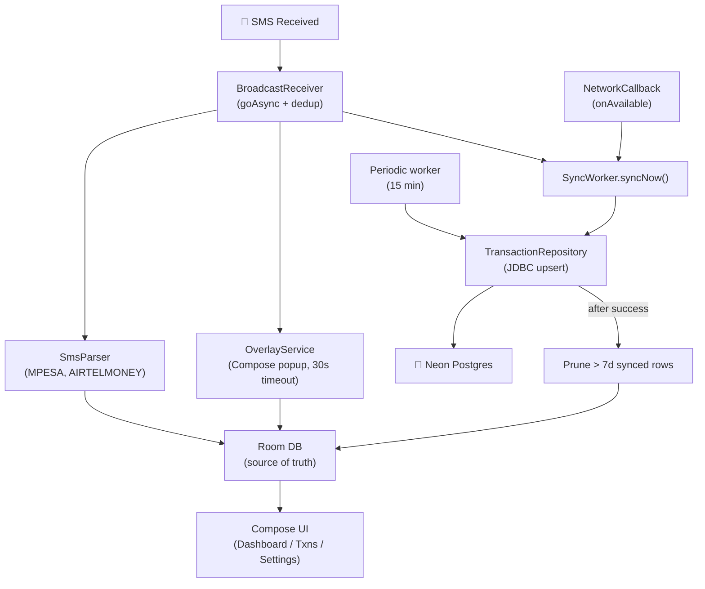

# Personal Finance Tracker — Product Roadmap

## Overview

A personal native Android app that reads M-Pesa and Airtel Money SMS, auto-detects income vs expenses, prompts you to categorize each transaction via an overlay popup, and syncs everything to a **Neon Postgres** database — with full offline support. Single-user, sideloaded APK.

---

## Tech Stack (as built)

| Layer | Technology | Notes |
|---|---|---|
| **Mobile App** | **Kotlin + Jetpack Compose** | Native — required for SMS, overlay, background services. |
| **Local DB** | **Room (SQLite)** | Source of truth on device. Schema v2, exportSchema enabled. |
| **Remote DB** | **Neon Postgres** | Direct JDBC from the app. No backend, no auth, single user. |
| **Sync** | **WorkManager + ConnectivityManager** | Periodic 15-min push, plus immediate push on connectivity gain or new SMS. |
| **Pagination** | **Paging 3** | Transactions list is paged at 30/page from a `PagingSource`. |
| **Charts** | **Pure Compose Canvas** | Custom donut + line charts. No external chart lib. |
| **Notifications** | `WorkManager` + `NotificationCompat` | Daily digest, budget alerts. |
| **Overlay** | **Foreground Service + System Alert Window** | Floating categorization popup with 30 s auto-dismiss. |
| **Build** | **Gradle (Kotlin DSL)** | minSdk 26, targetSdk 35, Kotlin 2.0. Postgres JDBC driver in APK with multidex + core-library desugaring. |

> [!NOTE]
> **Auth deliberately stripped.** Personal sideloaded use only — no Google sign-in, no biometric, no RLS. The OS lock screen is the only gate. The Neon JDBC URL ships in `BuildConfig` and is recoverable from the APK; never share the APK.

---

## Implemented Features

### SMS ingestion
- `BroadcastReceiver` for `SMS_RECEIVED_ACTION` with `goAsync()` so the coroutine work isn't killed.
- Provider whitelist via `sms_sources` table — seeded with `MPESA` and `AIRTELMONEY`.
- Regex parsers for M-Pesa (received / sent / paid / withdraw) and Airtel Money (received / sent / paid / withdraw).
- Two-tier dedup: by `reference` when the SMS provides one, otherwise by SHA-256 of `(sender|body|timestamp/60s)`. Unique partial index in Room and Neon.
- Typed `TransactionMeta` JSON with `kotlinx.serialization` — replaces the old hand-built JSON string concat.

### Categorization overlay
- Floating popup over any app via `SYSTEM_ALERT_WINDOW`.
- Category picker, optional note field, confirm/dismiss actions.
- Smart category suggestion via indexed `counterparty` column (most common past category for the same merchant).
- **30-second auto-dismiss** — leaves the transaction as `UNCATEGORIZED` if the user doesn't act.

### Sync to Neon
- `TransactionRepository` opens a fresh JDBC connection per run; never holds one across calls.
- Atomic upsert: one prepared statement, single transaction, `RETURNING id` so we only mark the rows that actually landed.
- Errors classified by Postgres `SQLState`: `08*` → transient (retry), `23*`/`42*` → permanent, anything else → transient.
- Failure path increments `sync_failures` and stamps `last_sync_attempt_at` for diagnostics.
- Three triggers for sync:
  1. **Periodic** — 15-minute WorkManager job with network constraint and exponential backoff.
  2. **Connectivity gain** — `ConnectivityManager.NetworkCallback` fires `syncNow()` the moment the device comes back online.
  3. **New SMS** — `SmsReceiver` enqueues a one-shot sync after every successful insert.

### Local retention
- After every successful sync, transactions older than `LOCAL_RETENTION_DAYS = 7` and already synced are deleted from Room. Phone storage stays small; Neon keeps the full history.
- Pending uploads (`is_synced = 0`) are never pruned, regardless of age.

### Dashboard
- Month selector with summary cards (income, expense, net).
- Donut chart for expense breakdown by category.
- Line chart for spend trend (5-day buckets).
- Recurring patterns surfaced via `RecurringDetector`.
- Budget overrun warning panel with click-through to the budgets screen.

### Other screens
- Paged transactions list with filter chips (All / Income / Expense / Uncategorized) and full-text search over description and counterparty.
- CRUD for categories, accounts, SMS sources, budgets, savings goals, investments, debts.
- Manual transaction entry.

### Multi-section CSV export
- One CSV file containing every table — transactions, categories, accounts, budgets, savings goals, investments, debts.
- Modal with a unit dropdown (Weeks / Months / Years / All time) and a count input — pick exactly the window you want.
- File lands in `Downloads/expense-data-<date>.csv` via MediaStore on Q+; falls back to scoped storage on older devices.

### Notifications
- **Daily digest** at 20:00 — total spent, total received, transaction count.
- **Budget alerts** — daily check; notification fires when month-to-date spend on any category crosses 90 % of its budget.

### Permissions
- Runtime gate (`PermissionGate`) blocks the dashboard until SMS, notifications, and overlay permissions are granted. Each row has rationale text + a Grant button.

### Tests
- `SmsParserTest` — 12 cases across M-Pesa and Airtel Money plus negative cases for dropped providers.
- `TransactionDaoTest` (instrumented) — dedup unique-index, paging, sync-failure increment, seed integrity, suggested-category lookup.
- `TransactionRepositoryTest` — unconfigured-URL early return.
- `DashboardViewModelTest` — Turbine-driven flow combination, error catching, error-bus emission.

---

## Architecture



---

## What's not built (and why)

- **Hilt DI** — manual ViewModelProvider.Factory works fine for a single-module app; adding Hilt is mostly boilerplate without a payoff at this size.
- **Vico chart library** — evaluated; the trend chart is a 30-line Compose Canvas, no need to drag in an alpha-version 3 MB dep.
- **CSV encryption** — punted to v1.1; export goes to `Downloads/` unencrypted. Add password + AES if the threat model changes.
- **Realtime subscriptions** (Neon → app) — single-device, single-user; nothing pushes data from the server side.
- **Google Sign-in / RLS** — single-user app, intentionally removed. The Neon URL in BuildConfig is the security boundary.
- **Top-level snackbar host wired to the error bus** — `DashboardViewModel.errors` is exposed but not surfaced in the UI yet. Plumbing-only; can wire when needed.

---

## Project layout

```
app/src/main/java/com/personal/financetracker/
├── MainActivity.kt               # Permission gate → AppNavigation
├── FinanceTrackerApp.kt          # Worker schedules + connectivity callback
├── data/
│   ├── local/                    # Room: AppDatabase, entities, DAOs
│   └── remote/
│       ├── NeonClient.kt         # Singleton JDBC connection wrapper
│       └── TransactionRepository # Atomic batched upsert
├── domain/parser/SmsParser.kt    # Regex parsers (M-Pesa, Airtel Money)
├── service/
│   ├── SmsReceiver.kt            # goAsync + dedup + insert + immediate sync
│   ├── OverlayService.kt         # Floating popup + 30s timeout
│   ├── SyncWorker.kt             # Periodic + one-shot sync + prune
│   ├── ConnectivitySyncTrigger.kt# NetworkCallback → syncNow()
│   ├── DigestWorker.kt           # 20:00 daily digest
│   └── BudgetAlertWorker.kt      # Daily budget overrun check
├── ui/
│   ├── components/               # Charts, ErrorBoundary, PermissionGate, etc.
│   ├── overlay/TransactionPopup
│   ├── screens/                  # Dashboard, Transactions, Settings, etc.
│   └── viewmodel/                # Dashboard / Transactions VMs
└── util/                         # AppConfig, CsvExporter, FormatUtils, …

db/
├── migrations/001_initial.sql    # Neon schema
└── SETUP.md                      # End-to-end Neon setup
```

---

## Permissions

| Permission | Purpose |
|---|---|
| `READ_SMS` / `RECEIVE_SMS` | Parse incoming transaction SMS |
| `SYSTEM_ALERT_WINDOW` | Floating categorization popup |
| `INTERNET` | JDBC to Neon |
| `RECEIVE_BOOT_COMPLETED` | Restart SMS listener after reboot |
| `FOREGROUND_SERVICE` | Keep overlay alive |
| `POST_NOTIFICATIONS` | Daily digest + budget alerts (API 33+) |

`USE_BIOMETRIC` is **not** declared — the biometric gate was removed.

---

## Getting started

1. Open the project in **Android Studio** → File → Open → pick `automatic_finance_tracker/`.
2. Set up Neon and the JDBC URL — see [`db/SETUP.md`](db/SETUP.md).
3. Apply the schema: `psql "$NEON_URL" -f db/migrations/001_initial.sql`.
4. Sync the Gradle project (Studio prompts on first open).
5. ▶ Run on a phone or emulator.

---

## Tunable knobs

All in [`util/AppConfig.kt`](app/src/main/java/com/personal/financetracker/util/AppConfig.kt):

| Constant | Default | What it controls |
|---|---|---|
| `SYNC_INTERVAL_MINUTES` | 15 | Periodic-sync cadence (the safety net under the immediate triggers). |
| `DIGEST_HOUR` | 20 | Hour of day the daily digest fires. |
| `OVERLAY_TIMEOUT_SECONDS` | 30 | How long the categorization popup waits before auto-dismiss. |
| `DEDUP_BUCKET_MILLIS` | 60 000 | Time bucket for hash-based SMS dedup. |
| `BUDGET_ALERT_THRESHOLD` | 0.9 | Spend ratio that triggers a budget notification. |
| `LOCAL_RETENTION_DAYS` | 7 | Synced transactions older than this are pruned from Room after each successful sync. |

---

> [!TIP]
> The codebase intentionally stays small. New features should reuse existing utilities (`CategorySuggester`, `RecurringDetector`, `FormatUtils`) before adding new ones.
